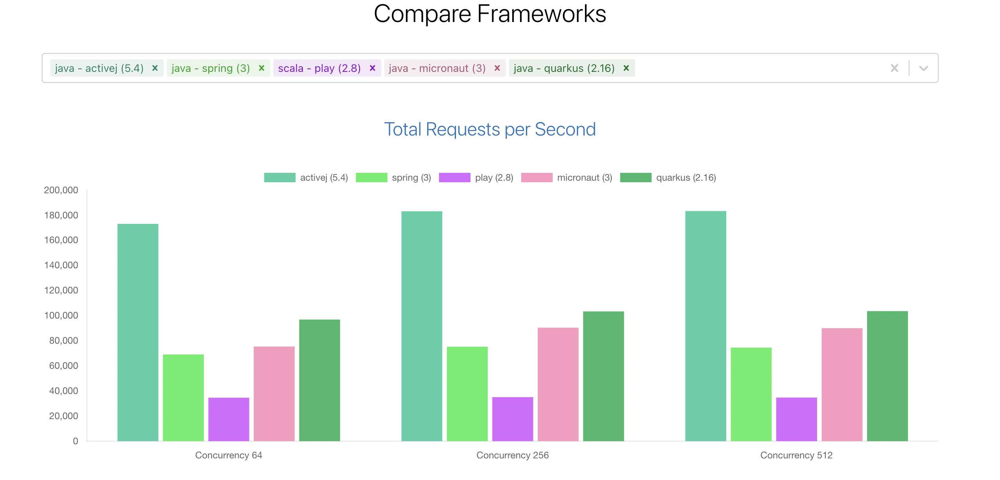

# ActiveJ Real World Project

This project is for learning ActiveJ Framework, run on JDK 17


## Information

 - [ActiveJ Homepage](https://activej.io/)
 - [ActiveJ Github](https://github.com/activej/activej)
 - [Compare benchmark result](https://web-frameworks-benchmark.netlify.app/compare?f=activej,spring,play,micronaut,quarkus)





ActiveJ is the best performance framework in Java on February 27, 2023.


## Libraries

This project use:

- **io.activej**: ActiveJ Framework
- **dsl-json-java8**: JSON serialization with high performance
- **logback-classic**: For logging
- **lombok**: For useful annotations
- **hibernate-hikaricp**: Work with database
- **mysql-connector-java**: For Mysql 8.0
- **liquibase-core**: For migrating at runtime

View `pom.xml` for more details


## Before run

Install JDK 17

Install MySQL v8

Setup database: Replace your config to file `app.properties`

## Run

On the local, run main file: `AppLauncher.java`

On the dev/production, run commands:
```
-> Build: maven package -DskipTests=true
-> Run:   java -Denv={dev/prod} -jar AppLauncher.jar
-> Build native: native-image -R:MaxHeapSize=2g --verbose -jar AppLauncher.jar
```

The application runs on port: 8080


## API Reference

#### Homepage (public)

```http
  GET http://localhost:8080
```

#### Health check (public)

```http
  GET http://localhost:8080/api/v1/health-check
```

#### Login (public)

```http
  GET http://localhost:8080/api/v1/login
```

Create a new session to access private router

#### Add user (public)

```http
  POST http://localhost:8080/api/v1/users
```

| JSON Body | Type     | Description         |
| :-------- | :------- | :------------------ |
| `name`    | `string` | **Required**        |
| `age`     | `int`    | **Required**        |

#### List all users (private)

```http
  GET http://localhost:8080/api/v1/users
```

If you don't login, you won't access this router

#### Get one user (private)

```http
  GET http://localhost:8080/api/v1/users/${userId}
```

If you don't login, you won't access this router


## Support

For support, contact email hungpt58.uet@gmail.com

